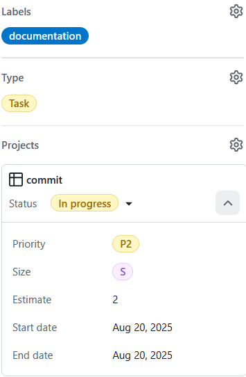

<p align="center">
  
</p>
<h1 align="center">commit.</h1>
<p align="center"><em>Goal-tracking app with financial stakes and private group challenges.</em></p>

> [!NOTE]
> Built for the PDG class at HEIG-VD. The monorepo includes:
>
> - Mobile Application (Expo/React Native)
> - Web Landing Page (Astro on Cloudflare Workers)

# Table of contents

<!-- mtoc-start -->

- [Quick links](#quick-links)
- [Monorepo layout](#monorepo-layout)
- [Tech stack](#tech-stack)
- [Prerequisites](#prerequisites)
- [Getting started](#getting-started)
- [Lint & tests](#lint--tests)
- [Contributing](#contributing)
- [Team](#team)

<!-- mtoc-end -->

## Quick links

- Software Requirements Specification (SRS): [PDF](./docs/software-requirements-specification.pdf) • [Markdown](./docs/software-requirements-specification.md)
- Architecture overview: [docs/architecture.md](./docs/architecture.md)
- User flow (screens): [docs/flow.txt](./docs/flow.txt)
- Mobile app (Expo): [apps/mobile/README.md](./apps/mobile/README.md)
- Web landing (Astro): [apps/web/README.md](./apps/web/README.md)

## Monorepo layout

    .
    ├─ apps/
    │  ├─ mobile/   # Expo + React Native (iOS/Android)
    │  └─ web/      # Astro landing (Cloudflare Workers)
    ├─ docs/        # SRS, architecture, flows, assets
    └─ package.json

## Tech stack

- Mobile: Expo, React Native, TypeScript
- Backend: Supabase
- Payments: Stripe Connect (CHF / TWINT in CH)
- Web: Astro, Cloudflare Workers
- Tooling: Node 22+, pnpm, ESLint + Prettier, Jest (mobile)

See the SRS for roles, scope, and constraints.

## Prerequisites

- Node.js 22+ and pnpm (install pnpm with: npm install -g pnpm@latest-10)
- Git
- For web: Cloudflare account for deploys

> [!TIP]
> Prefer pnpm at the workspace root to install all app dependencies at once.

## Getting started

> [!TIP]
> See app-specific guides after installing: `apps/mobile/README.md` and `apps/web/README.md`.

```bash
# Install workspace dependencies
pnpm install
```

## Lint & tests

CI runs lint + tests on PRs, on git push and on deployment.

To lint and test manually, use the following commands:

```bash
# Lint everything
pnpm lint

# Run mobile tests
pnpm test
```

> [!IMPORTANT]
> PRs must pass ESLint and Jest in CI before review. Run the commands above locally to catch issues early.

## Contributing



- Open an issue → complete its description → branch from it → PR with review + passing CI

## Team

Leonard Cseres • Tristan Gerber • Aladin Iseni • David Schildböck
