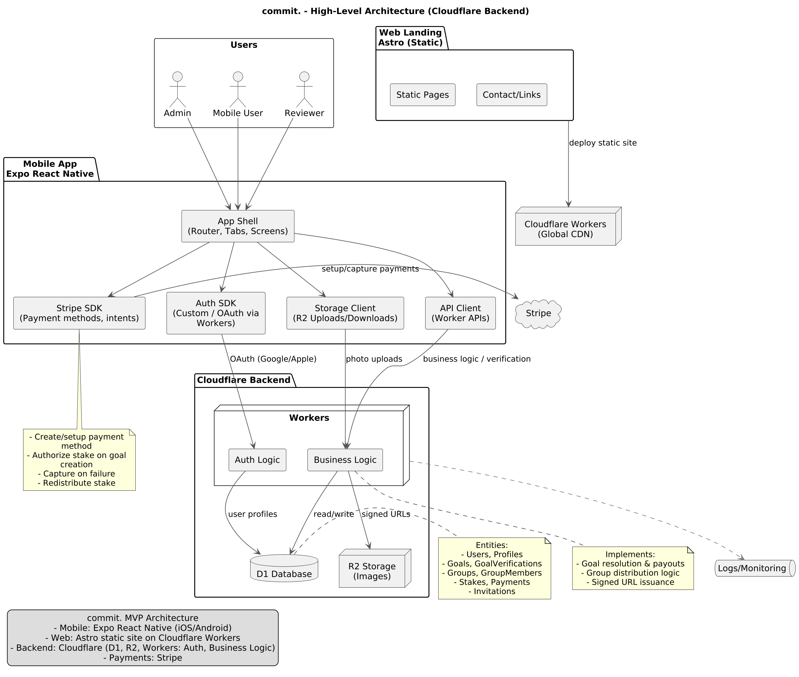

# Architecture Overview

## Table of Contents

1. [System Architecture](#system-architecture)
2. [Database Schema (MCD)](#database-schema-mcd)
3. [Branch-Based CI/CD Flow](#branch-based-cicd-flow)
4. [Main Branch CI/CD Flow](#main-branch-cicd-flow)

---

## System Architecture

High-level architecture diagram generated from `docs/architecture.puml` showing
the Expo React Native mobile app, Astro web landing (Cloudflare), Supabase
(Auth, Postgres, Storage, Edge Functions), and Stripe Connect integration.

---

## Database Schema

Entity-relationship diagram generated from `docs/db-schema.puml`.

---

## Branch-Based CI/CD Flow

Complete CI/CD workflow diagram showing how feature branches, pull requests,
and main branch interactions trigger different automated processes.

---

## Main Branch CI/CD Flow

Detailed sequence diagram focusing specifically on the CI/CD actions triggered
when changes are merged to the main branch.
