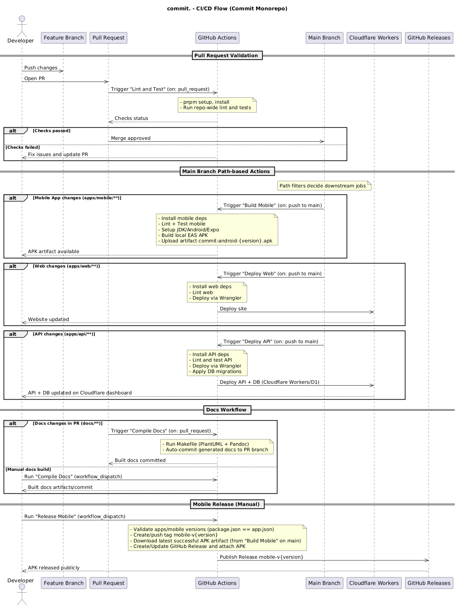

# Architecture Overview

## Table of Contents

1. [System Architecture](#system-architecture)
2. [Mobile UI Flow](#mobile-ui-flow)
3. [Database Schema (MCD)](#database-schema-mcd)
4. [Branch-Based CI/CD Flow](#branch-based-cicd-flow)
5. [CI/CD Flow](#cicd-flow)

---

## System Architecture

High-level architecture diagram generated from `docs/architecture.puml` showing
the Expo React Native mobile app, Astro web landing (Cloudflare), Supabase
(Auth, Postgres, Storage, Edge Functions), and Stripe Connect integration.

---

## Mobile UI Flow

Mobile app UI flow generated from `docs/ui-flow.puml`.

---

## Database Schema

Entity-relationship diagram generated from `docs/db-schema.puml`.

---

## Branch-Based CI/CD Flow

Complete CI/CD workflow diagram showing how feature branches, pull requests,
and main branch interactions trigger different automated processes.

---

## CI/CD Flow

Consolidated CI/CD sequence diagram generated from `docs/cicd-flow.puml` showing PR checks, path-filtered jobs on main (mobile APK build, web deploy), docs compilation, and the manual mobile release workflow.
